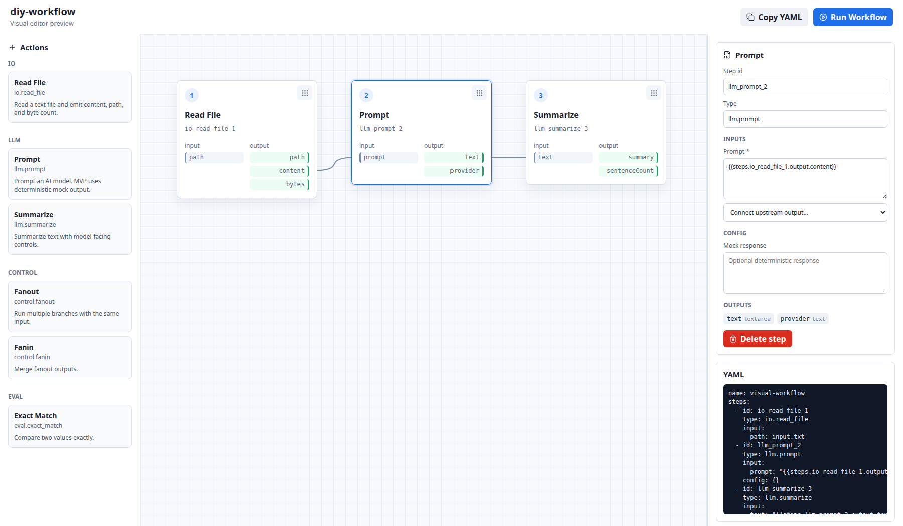

# diy-workflow

diy-workflow is a TypeScript workflow experiment engine built around typed reusable actions.

It is CLI-first today, with a visual editor foundation for building workflows by connecting typed action outputs into later action inputs.

## Quick Start

~~~sh
npm install
npm run check
~~~

Run an example workflow:

~~~sh
npm run build
node dist/cli.js validate examples/summarize.yaml
node dist/cli.js run examples/summarize.yaml
node dist/cli.js runs list
~~~

Start the visual editor:

~~~sh
npm run build
npm run build:ui
npm run serve -- --host 127.0.0.1 --port 4173
~~~

Open:

~~~text
http://127.0.0.1:4173/
~~~

The editor can load an existing `.yaml` / `.yml` workflow from local disk, save back to the opened file when the browser supports the File System Access API, and otherwise download the current YAML.

## Core Concepts

- Workflows are YAML documents with ordered steps.
- Workflows can optionally declare a workspace-level `providerCatalog` for LLM providers and models.
- Each LLM step can optionally override the workflow default with its own `config.providerId` and `config.modelId`.
- Every step has an `id`, action `type`, `input`, and optional `config`.
- Every action defines typed input and output schemas.
- Outputs are connected into later inputs with references like `{{steps.read.output.content}}`.
- Workflows are validated before execution.
- Runs write traces under `runs/run_xxxx/trace.json`.

## Common Commands

~~~sh
node dist/cli.js validate workflow.yaml
node dist/cli.js run workflow.yaml
node dist/cli.js runs list
node dist/cli.js runs show run_0001
node dist/cli.js serve --host 127.0.0.1 --port 4173
~~~

## Documentation

- [Getting started](docs/getting-started.md): install, build, run examples, and serve the editor.
- [Workflow YAML](docs/workflows.md): workflow shape, step references, validation, and traces.
- [Provider and model configuration](docs/provider-models.md): provider catalog source of truth, defaults, overrides, runtime resolution, and secret handling.
- [Actions](docs/actions.md): built-in actions, schemas, registry, config, and mock mode.
- [Visual editor](docs/visual-editor.md): editor capabilities, UI-friendly schema model, and localization.
- [Architecture](docs/architecture.md): project layout and execution flow.

## Built-In Actions

- `io.read_file`
- `io.read_image`
- `llm.prompt`
- `llm.vision_analyze`
- `llm.ocr`
- `llm.summarize`
- `control.fanout`
- `control.fanin`
- `eval.exact_match`

## Project Status

This is an MVP for experimenting with typed workflow composition. The current implementation focuses on a clean engine, deterministic tests, CLI execution, and a UI-ready action model.

LLM provider catalog support currently lives in the workflow document itself. Legacy workflows that omit `providerCatalog` fall back to a built-in deterministic `mock` provider and model.
When an LLM step omits `config.providerId` and `config.modelId`, it inherits the workflow defaults. When it sets either value, both must be valid and refer to an enabled provider/model pair.
